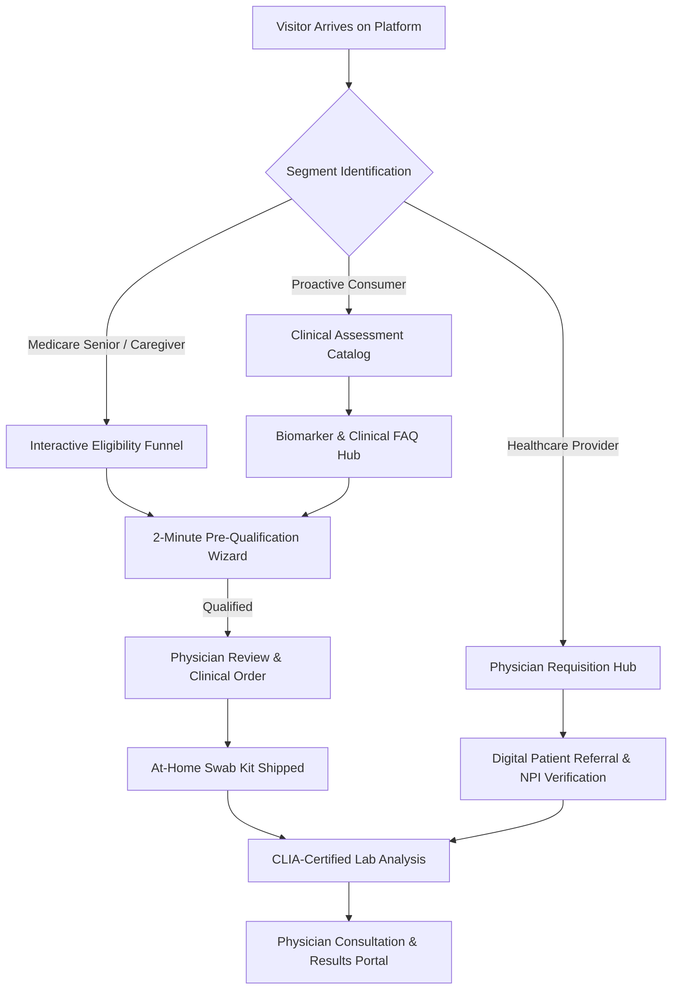

# Product Requirements Document (PRD)
# NextGen Preventive Genomics & Medicare Wellness Platform
**Project Codename:** `senior wellness care` / `VanguardHealth`  
**Target Architecture:** Next.js 14/15 (App Router), Tailwind CSS, TypeScript (Strict)  
**Document Version:** 1.0.0 (Master Technical Specification)

---

## 1. Executive Summary & Product Vision

### 1.1 Executive Summary
The NextGen Preventive Genomics and Medicare Wellness Platform is an enterprise-grade digital health solution designed to connect prospective patients, Medicare Part B beneficiaries, independent licensed physician networks, and federally certified CLIA/CAP genomics laboratories. 

The platform empowers patients and family caregivers to identify hereditary disease risks (CGx), optimize medication regimens (PGx), evaluate neurocognitive decline and immunodeficiencies, and access physician-ordered preventive diagnostics—often with **$0 out-of-pocket costs** under Medicare Part B when medically appropriate.

### 1.2 Product Vision & Core Mission
To establish the digital benchmark for preventive genomic healthcare in the United States by marrying a **high-trust, clinical-grade visual identity** with a **frictionless, high-empathy patient onboarding and eligibility engine**. The platform transforms complex clinical genomics into an intuitive, accessible, and physician-governed experience that drives early disease detection and personalized care planning.

### 1.3 Key Strategic Pillars
1. **Clinical Authority & Trust:** Every diagnostic test is ordered by a state-licensed physician and processed through CLIA-certified, CAP-accredited laboratories.
2. **Zero-Friction Eligibility Engine:** An intelligent 2-minute pre-qualification wizard that assesses Medicare Part B and commercial insurance criteria without invasive medical paperwork upfront.
3. **Painless At-Home Collection:** Non-invasive, 5-minute buccal (cheek) swab collection kits delivered directly to patients' doorsteps with 2-way trackable shipping.
4. **Multi-Stakeholder Architecture:** Specialized digital pathways for Seniors (Ages 65+), Adult Child Caregivers, Self-Directed Health Explorers, and Referring Primary Care Physicians (PCPs).

---

## 2. Target Personas & Core User Journeys

### 2.1 Persona Definitions



| Persona | Demographics & Context | Primary Motivations | Key Anxieties & Blockers | Primary Journey |
| :--- | :--- | :--- | :--- | :--- |
| **Harold (Senior Beneficiary)** | Age 68, enrolled in Medicare Part B, taking 5 daily prescriptions, family history of colorectal cancer. | Wants to know if his medications are safe (PGx) and check if Medicare covers tests without surprise bills. | Fear of needles, distrust of digital forms, anxiety over hidden medical debt. | Hero Banner $\rightarrow$ 2-Min Eligibility Wizard $\rightarrow$ Instant Pre-Approval $\rightarrow$ Free Swab Kit Delivery. |
| **Sarah (Adult Caregiver)** | Age 42, managing healthcare for aging parents experiencing mild memory loss and fatigue. | Seeks reputable diagnostic screening for neurological and immunodeficiency markers; wants verified credentials. | Worried about internet scams, predatory healthcare marketing, and complex onboarding. | Value Proposition $\rightarrow$ Clinical Science / Quality Page $\rightarrow$ How It Works $\rightarrow$ Initiates Intake for Parent. |
| **Dr. Robert Vance (PCP)** | Age 51, Family Medicine Physician with a 60% Medicare patient panel. | Seeks a streamlined way to order preventive genetics and medication reviews for patients without paperwork overhead. | Lack of in-house genetic specialists, prior-authorization delays, clunky lab portals. | Providers Hub $\rightarrow$ Digital Order Requisition $\rightarrow$ Clinical Coding Guide $\rightarrow$ Patient Co-Management. |
| **Elena (Proactive Consumer)** | Age 38, commercially insured, interested in preventive longevity and hereditary cancer risk. | Wants actionable genomic sequencing and certified genetic counseling. | 6-month clinical waitlists for hospital genetics clinics. | Programs Catalog $\rightarrow$ Cancer Screening Deep-Dive $\rightarrow$ Insurance Pre-Check $\rightarrow$ Tele-Counseling Booking. |

---

## 3. Brand, UI/UX & Design System Specification

### 3.1 Design Philosophy (GeneDx-Inspired Aesthetic)
The visual theme is inspired by premier clinical diagnostic leaders: **deep, authoritative navy surfaces paired with crisp slate backgrounds, vibrant cyan and clinical teal focal accents, high-contrast typography, generous whitespace, subtle frosted glass cards, and smooth micro-interactions**.

> [!IMPORTANT]
> **Design vs. Content Independence:** All visual and UI styling embodies the sleek, premium, high-tech clinical authority of GeneDx, while all textual content, copy, service hierarchies, and eligibility flows are 100% original and structured around preventive wellness and Medicare qualification.

### 3.2 Design Tokens & Color System

```css
/* Core Dark & Foundation Palette */
--navy-950:       #080E1E; /* Primary canvas dark & deep contrast text */
--navy-900:       #0C162C; /* Deep brand hero backgrounds & dark cards */
--navy-800:       #132244; /* Navbars, dark card surfaces, footer bg */
--navy-700:       #1E3566; /* Interactive borders & focus outlines */

/* Accent & Interactive Palette */
--cyan-500:       #00B4D8; /* Primary action cyan / active toggles */
--cyan-400:       #38BDF8; /* Hover states, glowing badges */
--teal-600:       #0D9488; /* Clinical validation badges */
--teal-500:       #14B8A6; /* Trust signals & success pills */
--emerald-500:    #10B981; /* $0 Cost / Verified eligibility states */

/* Light Surfaces & Neutral Scale */
--slate-50:       #F8FAFC; /* Page canvas background */
--slate-100:      #F1F5F9; /* Card surface backgrounds */
--slate-200:      #E2E8F0; /* Clean dividers & input borders */
--slate-500:      #64748B; /* Secondary captions & metadata */
--slate-700:      #334155; /* Secondary body typography */
--slate-900:      #0F172A; /* Primary dark text */
```

### 3.3 Typography Hierarchy

| Level | Font Family | Weight | Desktop Specs | Mobile Specs | Tracking | Usage |
| :--- | :--- | :--- | :--- | :--- | :--- | :--- |
| **Display H1** | `Plus Jakarta Sans` | Bold (700) | `56px / 1.1` | `36px / 1.2` | `-0.025em` | Hero Headings & Hub Landings |
| **Heading H2** | `Plus Jakarta Sans` | SemiBold (600) | `40px / 1.2` | `28px / 1.25` | `-0.02em` | Major Section Headers |
| **Heading H3** | `Plus Jakarta Sans` | SemiBold (600) | `26px / 1.3` | `22px / 1.3` | `-0.01em` | Program Cards, Feature Headers |
| **Heading H4** | `Plus Jakarta Sans` | Medium (500) | `20px / 1.4` | `18px / 1.4` | `0em` | Subsection Callouts |
| **Body Large** | `Inter` | Regular (400) | `18px / 1.6` | `16px / 1.5` | `0em` | Hero Subtitles & Lead Paragraphs |
| **Body Default**| `Inter` | Regular (400) | `16px / 1.6` | `15px / 1.6` | `0em` | Standard Body Copy & FAQs |
| **Badge/Label** | `Inter` | SemiBold (600) | `13px / 1.4` | `12px / 1.4` | `+0.06em` | Uppercase Clinical Eyebrows |

---

## 4. Comprehensive Information Architecture & Sitemap

```
├── / (Home)
├── /programs (Clinical Diagnostic Programs Hub)
│   ├── /programs/cancer-genetics (CGx Hereditary Cancer Predisposition)
│   ├── /programs/pharmacogenomics (PGx Drug-Gene Response)
│   ├── /programs/neurocognitive (Dementia & Neurological Risk)
│   ├── /programs/immunodeficiency (Immune Dysfunction & Primary Deficiencies)
│   ├── /programs/cardiovascular (Cardiometabolic & Inherited Heart Risk)
│   ├── /programs/pulmonary (Respiratory & Alpha-1 Genetics)
│   ├── /programs/metabolic-diabetes (Metabolic Syndrome & Diabetes Genetics)
│   ├── /programs/thyroid-endocrine (Endocrine & Autoimmune Thyroid)
│   └── /programs/ophthalmic (Inherited Vision & Eye Health)
├── /how-it-works (4-Step Guided Process & At-Home Kit Delivery)
├── /medicare-eligibility (Medicare Part B Coverage & $0 Out-of-Pocket Breakdown)
├── /eligibility-checker (Interactive Multi-Step Qualification Wizard)
├── /providers (Physician Network, Clinical Workflow & Order Requisitions)
│   └── /providers/referral (Secure Provider Order Form)
├── /resources (Education, Guides & Evidence-Based Insights)
│   ├── /resources/faq (Expanded Clinical & Billing FAQs)
│   ├── /resources/sample-reports (Interactive Genetic Test Report Walkthroughs)
│   └── /resources/articles (Searchable Healthcare Knowledge Hub)
├── /track-kit (Real-Time Buccal Swab Kit & Lab Order Status Tracker)
├── /about-us (Mission, Clinical Advisory Board & CLIA-Partner Network)
├── /quality-accreditation (CLIA/CAP Standards, Privacy & Lab Verification)
├── /contact (Patient & Physician Consultation Request)
├── /privacy-policy (HIPAA & Health Data Privacy Policy)
└── /terms-of-service (Patient & Website Terms)
```

---

## 5. Page-by-Page Technical & Content Specifications

### Specification Schema:
`Page -> Purpose -> Target User -> Sections -> Content -> Components -> CTA -> User Interaction -> Functional Requirements`

---

### Page 5.1: Homepage (`/`)
- **Purpose:** Primary digital storefront that establishes clinical authority, presents available genetic screening panels, demystifies Medicare coverage, and drives users into the eligibility pre-qualification wizard.
- **Target User:** Medicare recipients (65+), adult children/caregivers, proactive adults, referring physicians.
- **Sections:**
  1. Top Alert Bar (Medicare Part B $0 Coverage Guarantee).
  2. Hero Section with dynamic value proposition, clinical badges, and quick-start eligibility check.
  3. Trust & Credibility Bar (CLIA, CAP, HIPAA, Licensed Provider Network).
  4. 4-Step Patient Journey (Eligibility $\rightarrow$ MD Order $\rightarrow$ At-Home Swab $\rightarrow$ Results).
  5. 9 Clinical Diagnostic Programs Grid with interactive disease filter pills.
  6. Medicare vs. Commercial Coverage & Out-of-Pocket Cost Comparison Table.
  7. Senior & Caregiver Real-World Stories & Clinical Endorsements.
  8. Interactive FAQ Accordion (Top 6 most common questions).
  9. High-Impact Action Banner with reassurance badges.
- **Content & Copy Blueprint:**
  - *Hero Headline (H1):* "Unlock Your DNA Blueprint for Proactive Health and Disease Prevention"
  - *Hero Subhead:* "Access comprehensive, physician-ordered genetic testing from the comfort of home. Covered 100% by Medicare Part B for qualifying individuals — painless 5-minute cheek swab, CLIA-certified laboratory processing, and personalized medical guidance."
  - *Key Hero Metrics:* 10,000+ Seniors Screened • 100% Physician Ordered • CLIA/CAP Accredited • $0 Cost for Qualifying Medicare Beneficiaries.
- **Components:** `TopAlertBanner`, `HeroHeader`, `TrustMarquee`, `ProcessStepsGrid`, `ProgramCardDeck`, `CoverageComparisonTable`, `TestimonialCarousel`, `FaqAccordion`, `StickyMobileActionBar`.
- **CTA:** Primary: `Check My Eligibility ($0 Cost) ->`; Secondary: `Explore 9 Clinical Programs v`.
- **User Interaction:** Filterable program cards by health area, animated timeline step reveals, sticky mobile conversion button.
- **Functional Requirements:** SSG with ISR (1-hour revalidation), sub-1.2s LCP, zero layout shift (CLS < 0.02).

---

### Page 5.2: The 9 Dedicated Clinical Program Pages (`/programs/*`)
- **Purpose:** In-depth clinical pages providing patients and physicians with granular disease education, gene lists, diagnostic indications, and instant qualification for each test panel.
- **Target User:** Patients or caregivers investigating specific health concerns or family predispositions.
- **The 9 Programs Specification:**

| Route | Program Name | Key Biomarkers / Genes | Clinical Indications & Symptoms | Medicare Part B Coverage Context |
| :--- | :--- | :--- | :--- | :--- |
| `/programs/cancer-genetics` | **Hereditary Cancer (CGx)** | `BRCA1, BRCA2, MLH1, MSH2, MSH6, PMS2, TP53, PTEN, PALB2, CHEK2, CDH1` | Family history of breast, ovarian, colorectal, prostate, pancreatic, or uterine cancer; multiple relatives affected. | Covered under Part B when personal or multi-generational family history indicates elevated genetic risk. |
| `/programs/pharmacogenomics` | **Pharmacogenomics (PGx)** | `CYP2D6, CYP2C19, CYP2C9, VKORC1, SLCO1B1, CYP3A4, CYP3A5, DPYD` | Taking 3+ daily prescription medications, history of adverse drug reactions, suboptimal response to cardiac/depression/pain meds. | Covered for seniors on polypharmacy regimens to prevent dangerous drug-gene interactions. |
| `/programs/neurocognitive` | **Neurocognitive & Dementia** | `APOE (e2/e3/e4 alleles), PSEN1, PSEN2, APP, MAPT, GRN` | Age-related memory concerns, family history of early-onset Alzheimer's, Parkinson's disease, or frontotemporal dementia. | Covered for symptomatic patients or those with multi-generational neurodegenerative history. |
| `/programs/immunodeficiency` | **Primary Immunodeficiency** | `BTK, CD40LG, STAT1, STAT3, NFKB1, IL2RG, RAG1, RAG2, CTLA4` | Recurrent severe infections (sinusitis, pneumonia, ear), poor response to antibiotics, chronic fatigue, delayed wound healing. | Covered for beneficiaries with documented recurring infections meeting clinical diagnostic thresholds. |
| `/programs/cardiovascular` | **Cardiovascular & Cardiometabolic** | `LDLR, APOB, PCSK9, MYH7, MYBPC3, KCNQ1, SCN5A, FBN1` | Early heart attack or stroke in family (<55 yrs), severe hypercholesterolemia, familial cardiomyopathy, arrhythmias. | Covered when personal lipid profiles or family history indicates inherited hypercholesterolemia. |
| `/programs/pulmonary` | **Pulmonary & Respiratory** | `SERPINA1 (Alpha-1), CFTR, SFTPC, ABCA3` | Chronic COPD/emphysema in non-smokers, severe adult-onset asthma, familial pulmonary fibrosis. | Covered for diagnostic confirmation of Alpha-1 Antitrypsin Deficiency and inherited respiratory risk. |
| `/programs/metabolic-diabetes` | **Metabolic & Monogenic Diabetes** | `GCK, HNF1A, HNF4A, TCF7L2, PPARG, KCNJ11` | Early-onset diabetes with normal BMI, atypical type 2 diabetes, severe insulin resistance, familial metabolic syndrome. | Covered to distinguish monogenic maturity-onset diabetes of the young (MODY) from standard diabetes. |
| `/programs/thyroid-endocrine` | **Thyroid & Endocrine Health** | `RET, MEN1, TSHR, TG, TPO, autoimmune thyroid risk loci` | Persistent thyroid nodules, Hashimoto's disease, Graves' disease, familial endocrine neoplasia. | Covered for evaluation of hereditary medullary thyroid carcinoma and severe autoimmune dysregulation. |
| `/programs/ophthalmic` | **Inherited Ophthalmic & Vision** | `ABCA4, BEST1, RPGR, RHO, MYOC, OPTN, LOXL1` | Progressive vision loss, early macular degeneration, family history of glaucoma at young age, retinitis pigmentosa. | Covered for patients with progressive vision degradation and familial ophthalmic pathology. |

- **Layout Structure (Each Page):**
  1. Clinical Breadcrumbs (`Home > Programs > [Program Name]`).
  2. Hero Section with Clinical Badge, Headline, and Instant Eligibility Checker trigger.
  3. "Who Should Consider This Panel?" 6-card clinical symptom checker.
  4. Gene Biomarker Table with actionable clinical implications.
  5. Interactive Sample Report Preview showing sample results (Negative, Moderate Risk, Actionable).
  6. Direct Pre-Qualification Banner with pre-selected program filter.
- **Components:** `ProgramHero`, `GeneBiomarkerTable`, `ClinicalIndicationsGrid`, `SampleReportCard`, `MedicareCoverageBadge`, `DirectPreQualCTA`.
- **Functional Requirements:** Dynamic slug routing (`app/programs/[slug]/page.tsx`), JSON-LD `MedicalTest` structured data for search engine rich snippets.

---

### Page 5.3: Medicare & Insurance Coverage Hub (`/medicare-eligibility`)
- **Purpose:** Authoritative educational resource explaining how Medicare Part B covers physician-ordered preventive genomics at $0 out-of-pocket.
- **Target User:** Medicare beneficiaries, Medicare Advantage plan holders, commercial insurance patients, caregivers.
- **Sections:**
  1. The $0 Out-of-Pocket Guarantee Explained.
  2. Coverage Matrix: Traditional Medicare Part B vs. Medicare Advantage vs. Commercial Insurance vs. Self-Pay.
  3. CMS Medical Necessity Guidelines & Why Physician Orders are Mandatory.
  4. "No Surprise Billing" 4-Point Patient Protection Pledge.
  5. Interactive Pre-Qualification Funnel Trigger.
- **Components:** `CoverageMatrixTable`, `InsuranceAccordion`, `TrustPledgeCard`, `CmsGuidelineExplainer`.
- **CTA:** `Verify Your Medicare Eligibility in 2 Minutes ->`.
- **Functional Requirements:** Accessible tables with WCAG 2.1 AA senior-readable high contrast, print-friendly stylesheet.

---

### Page 5.4: Interactive Pre-Qualification & Eligibility Wizard (`/eligibility-checker`)
- **Purpose:** Core conversion engine of the platform. A high-empathy, 6-step guided wizard that qualifies patients for covered testing and captures secure lead data for physician review.
- **Target User:** Prospective patients or caregivers seeking testing.
- **Wizard Steps:**
  - **Step 1: Primary Insurance:** Select Medicare Part B, Medicare Advantage, Commercial Insurance, Medicaid/Uninsured, or Self-Pay.
  - **Step 2: Demographics:** Date of Birth, Gender, State of Residence (for physician licensing match).
  - **Step 3: Medical & Family History:** Multi-select conditions (Cancer, Heart, Dementia, Recurring Infections, Respiratory, etc.).
  - **Step 4: Medication Profile:** Number of daily prescription medications (0-2, 3-5, 6+) and adverse reaction history.
  - **Step 5: Contact & Delivery Information:** First/Last Name, Email, Phone, Delivery Address, Caregiver toggle, SMS Consent.
  - **Step 6: Instant Results & Summary Screen:** Immediate feedback showing estimated Medicare coverage ($0 for Part B) and next steps for physician review.
- **Components:** `WizardController`, `StepProgressBar`, `AnimatedStepContainer`, `RadioOptionCards`, `AddressAutocomplete`, `SuccessConfettiBanner`.
- **CTA:** `Complete Pre-Qualification & Request Free Swab Kit ->`.
- **User Interaction:** Animated step transitions (Framer Motion), real-time field validation (Zod), auto-save progress in session storage.
- **Functional Requirements:** Server Action / API endpoint (`/api/eligibility/evaluate`), HIPAA data encryption at rest (AES-256), webhook dispatch to clinical intake CRM.

---

### Page 5.5: How It Works & At-Home Collection Experience (`/how-it-works`)
- **Purpose:** Demystifies the testing journey, eliminates patient hesitation around cheek swabs, and explains laboratory processing turnaround times.
- **Target User:** Seniors, caregivers, and newly qualified patients awaiting their kits.
- **Sections:**
  1. 4-Stage Lifecycle (Eligibility $\rightarrow$ MD Order $\rightarrow$ Swab $\rightarrow$ Results).
  2. Inside Your At-Home Kit (Interactive 3D unboxing of swabs, tubes, prepaid return mailer).
  3. 5-Minute Cheek Swab Guide (Step-by-step illustrations with senior-friendly instructions).
  4. Inside the CLIA/CAP Certified Laboratory (High-complexity Next-Gen Sequencing).
  5. Post-Test Physician Consultation & Medical Guidance.
- **Components:** `InteractiveUnboxingCard`, `StepTimeline`, `LabVideoMockup`, `FaqQuickLinks`.
- **CTA:** `Get Started With At-Home Screening ->`.

---

### Page 5.6: Healthcare Providers & Clinical Portal (`/providers` & `/providers/referral`)
- **Purpose:** Professional portal for primary care physicians, oncologists, and geriatricians to learn about clinical utility, download gene lists, and digitally refer patients.
- **Target User:** Licensed medical providers (MD, DO, NP, PA) and practice managers.
- **Sections:**
  1. Physician Value Proposition (Preventive risk stratification & adverse drug event prevention).
  2. Test Menu & Biomarker Directory (Downloadable PDF requisitions).
  3. Digital Patient Referral Form (`/providers/referral`): Provider NPI, Medical License #, Practice Name, Patient Clinical Details, Panel Selection, and Digital Signature.
  4. CMS Medical Necessity Billing & Coding Reference Guide (CPT & ICD-10 crosswalk).
- **Components:** `ProviderHero`, `BiomarkerDownloadTray`, `NpiLookupInput`, `DigitalSignaturePad`, `EhrIntegrationFaq`.
- **CTA:** `Submit Patient Requisition Online ->` or `Download Clinical Test Menu (PDF)`.

---

### Page 5.7: Education, FAQ & Sample Reports Hub (`/resources/*`)
- **Purpose:** Authority content engine that drives high-intent organic search traffic (SEO), educates patients and adult children, and provides transparency with interactive sample genetic reports.
- **Sub-Pages:**
  - `/resources/faq`: Real-time searchable FAQ across 5 categories (Medicare, Testing, Science, Doctors, Privacy).
  - `/resources/sample-reports`: Interactive visualizer of comprehensive CGx and PGx genetic reports.
  - `/resources/articles`: Educational articles explaining hereditary health, drug metabolism, and Medicare preventive wellness.
- **Components:** `FaqSearchInput`, `CategoryFilterPills`, `InteractiveReportViewer`, `ArticleCardGrid`, `NewsletterSignup`.

---

### Page 5.8: Specimen Tracker & Order Status Tool (`/track-kit`)
- **Purpose:** Self-service portal for patients and caregivers to check the exact shipping, laboratory processing, and physician review status of their at-home swab kit.
- **Target User:** Patients awaiting swab kit delivery or lab sequencing results.
- **Sections:**
  1. Order Lookup Form (Order Confirmation # / Phone Number + ZIP Code).
  2. Visual 5-Stage Live Progress Stepper:
     - 1. Physician Approved & Order Generated
     - 2. Kit Dispatched via USPS Priority (with live tracking link)
     - 3. Specimen Received at CLIA Laboratory
     - 4. High-Throughput Genomic Analysis Underway
     - 5. Results Completed & Consultation Scheduled
  3. SMS Notification Preference Toggle.
- **Components:** `TrackingLookupCard`, `AnimatedTimelineStepper`, `CarrierStatusBadge`.
- **CTA:** `Track Another Order` or `Contact Patient Concierge`.

---

### Page 5.9: Quality, Accreditation & Compliance (`/quality-accreditation`)
- **Purpose:** Reassure prospective patients and clinical partners by detailing federal certifications and laboratory standards.
- **Content:** CLIA Federal Certification, CAP Peer-Reviewed Accreditation, GINA Anti-Discrimination Protections, HIPAA 256-Bit Data Security, and Quality Assurance Protocols.
- **Components:** `AccreditationCertificateShowcase`, `SecurityProtocolGrid`, `GinaProtectionExplainer`.

---

### Page 5.10: About Us & Medical Leadership (`/about-us`)
- **Purpose:** Humanize the organization, showcase medical leadership, communicate the founding mission of democratizing preventive genomics, and reinforce clinical authority.
- **Sections:** Our Mission, Medical Advisory Board (MD/PhD bios), Partner Laboratory Footprint (190+ labs across 48 states), and Patient Impact Statistics.
- **Components:** `LeadershipBioCard`, `MissionStatementBanner`, `InteractiveStateMap`.

---

### Page 5.11: Contact & Patient Support (`/contact`)
- **Purpose:** Multi-channel customer service and clinical inquiry center.
- **Sections:** Click-to-call direct phone hotline (800-XXX-XXXX), Secure Contact Form, Provider Hotline, and Physical Headquarters Information.
- **Components:** `ContactForm`, `SupportHoursCard`, `InteractiveLocationMap`.

---

## 6. Technical Architecture & Next.js + TypeScript + Tailwind Specification

### 6.1 Tech Stack Blueprint
- **Framework:** Next.js 14/15 (App Router, Server Components & Server Actions)
- **Language:** TypeScript (Strict Mode, 100% type safety)
- **Styling:** Tailwind CSS (with custom clinical design tokens)
- **Icons:** Lucide React
- **Animations:** Framer Motion (for smooth step transitions and micro-interactions)
- **Forms & Validation:** React Hook Form + Zod
- **UI Primitives:** Radix UI / Shadcn UI primitives

### 6.2 Data Models & TypeScript Interfaces

```typescript
// types/program.ts
export interface DiagnosticProgram {
  id: string;
  slug: string;
  name: string;
  clinicalCode: string;
  shortDescription: string;
  fullOverview: string;
  iconName: string;
  genesAnalyzed: string[];
  clinicalIndications: string[];
  medicareCoverageCriteria: string;
  sampleReportSummary: string;
}

// types/tracking.ts
export interface KitOrderStatus {
  orderId: string;
  patientName: string;
  currentStep: 1 | 2 | 3 | 4 | 5;
  stepLabels: string[];
  trackingNumber?: string;
  carrier: 'USPS' | 'FedEx' | 'UPS';
  estimatedDeliveryDate?: string;
  updatedAt: string;
}

// types/eligibility.ts
import { z } from 'zod';

export const EligibilityFormSchema = z.object({
  insuranceType: z.enum(['medicare_part_b', 'medicare_advantage', 'commercial', 'self_pay']),
  dateOfBirth: z.string().regex(/^\d{4}-\d{2}-\d{2}$/, 'Valid birth date required'),
  gender: z.enum(['male', 'female', 'other']),
  state: z.string().length(2, 'Valid 2-letter state code required'),
  conditions: z.array(z.string()).min(1, 'Please select at least one option'),
  dailyMedsCount: z.enum(['0_2', '3_5', '6_plus']),
  adverseReactions: z.boolean(),
  firstName: z.string().min(2, 'First name is required'),
  lastName: z.string().min(2, 'Last name is required'),
  email: z.string().email('Valid email is required'),
  phone: z.string().regex(/^\+?1?\d{10,14}$/, 'Valid phone number required'),
  streetAddress: z.string().min(5, 'Street address is required'),
  city: z.string().min(2, 'City is required'),
  zipCode: z.string().regex(/^\d{5}(-\d{4})?$/, 'Valid 5-digit ZIP code required'),
  isCaregiver: z.boolean().default(false),
  smsConsent: z.boolean().refine(val => val === true, 'Consent is required for kit tracking SMS')
});

export type EligibilityFormData = z.infer<typeof EligibilityFormSchema>;
```

---

## 7. HIPAA Compliance, Security & Data Governance

1. **Zero PHI in Third-Party Analytics:** GA4 and ad pixels receive only anonymized step events (`event: 'funnel_step_2'`). No names, birth dates, or health conditions are ever sent.
2. **End-to-End Encryption:** TLS 1.3 enforced for in-transit communication; AES-256 field-level encryption for at-rest storage of patient records.
3. **Role-Based Access Control (RBAC):** Strict separation of patient, administrative, and clinical provider roles.
4. **Mandatory Disclaimers:** Visible notices that the platform connects qualifying individuals with independent licensed physicians who order diagnostics when medically appropriate.

---

## 8. SEO, Performance & Accessibility

- **Core Web Vitals:** Target LCP $\le 1.2\text{ s}$, FID/INP $\le 50\text{ ms}$, CLS $\le 0.02$.
- **Accessibility:** WCAG 2.1 Level AA compliant, senior-friendly large typography (minimum 16px body), high contrast ratios (4.5:1+), full keyboard accessibility.
- **SEO:** Pre-rendered SSG pages, complete JSON-LD structured schemas (`MedicalOrganization`, `MedicalTest`, `FAQPage`).

---

## 9. Implementation Roadmap

- **Sprint 1 (Weeks 1-2):** Project scaffolding, Tailwind theme, core UI components (Navbar, Footer, Buttons, Cards).
- **Sprint 2 (Weeks 3-4):** Homepage, Medicare Coverage Hub, and dynamic 9 Clinical Program pages.
- **Sprint 3 (Weeks 5-6):** Multi-step Eligibility Wizard, Zod validation, API evaluation routes, and Kit Tracker.
- **Sprint 4 (Weeks 7-8):** Healthcare Provider Portal, digital referral form, FAQ center, and sample report explorer.
- **Sprint 5 (Weeks 9-10):** HIPAA security audit, WCAG AA compliance, SEO optimization, and production deployment.
